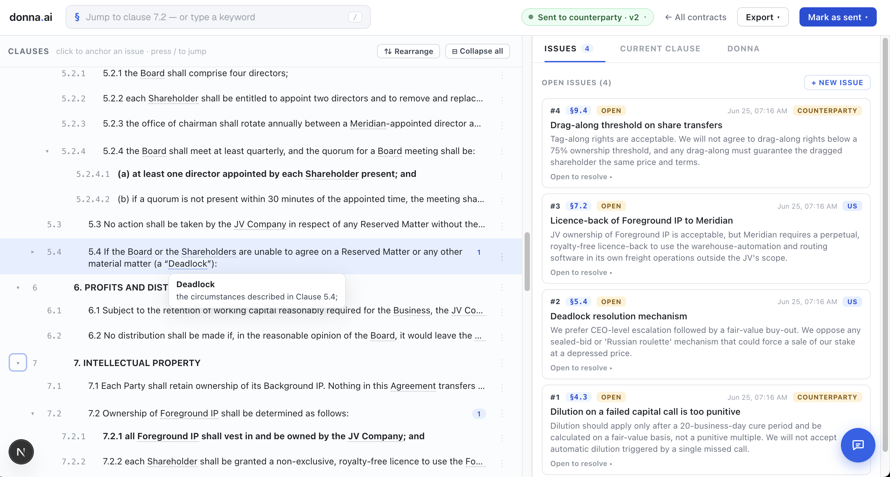
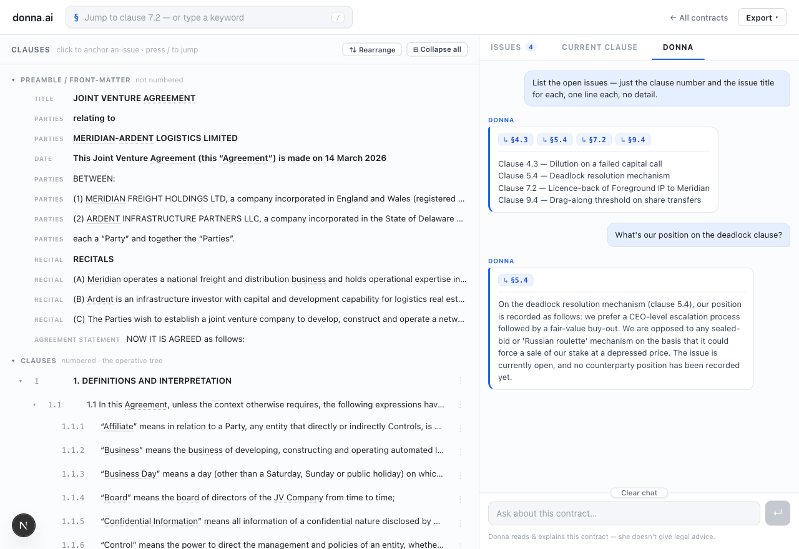
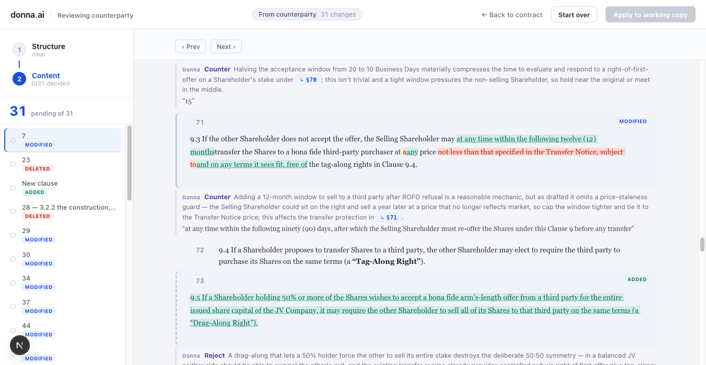

# donna.ai

Named after Donna Paulsen from Suits.

donna.ai is an open-source, AI-native system of record for legal contract review and
negotiation management — built for founders and business-development leads who
run their own legal work without in-house counsel.

It replaces the degrading "Word + tracked changes + comments + email" workflow:
contracts are imported as **structured data** and issues are tracked **per clause**.
When the counterparty sends back a revised file, donna.ai diffs it against the last
version you sent and walks you through the changes one at a time. **Donna**, the
built-in assistant, explains the contract **grounded in the actual text** and reviews
each proposed change — a verdict plus exact counter-language — with every claim cited
to a clause. Clean redlines export back to Word on demand.





<sub>The negotiation cockpit on a sample joint-venture agreement. Donna answers only from the contract and the issue ledger, with clickable clause citations — she reads and explains, never gives legal advice.</sub>



<sub>Reviewing a counterparty's clean revision. Donna grades each change and links the clauses behind each call as live references — as accept/reject decisions renumber the document, the chip number updates instead of going stale.</sub>

> Status: working local build. Architecture and data model are locked (`SPEC.md`,
> `DESIGN_DECISIONS.md`). What runs today: the **import spine** (parse → classify
> roles → review-and-correct → commit) with its review UI; a **home** screen of
> recent contracts; a **negotiation cockpit** for navigating and **directly editing**
> clauses (edit / insert / delete / drag-rearrange), tracking issues per clause, and
> **hover-to-define** defined terms; the **redline workflow** — import a counterparty's
> revised file, diff it against the last version you sent, and review the tracked
> changes in a two-pane document view; **`.docx` export** (clean copy, tracked-changes
> redline, issue-list — verified round-trip content fidelity); **Settings** for clients,
> deals, and contract types; and **Donna**'s intelligence layer — grounded Q&A, a
> verdict and counter-language on each proposed change, clause-grounded advice and
> drafting, and an ephemeral brainstorm panel that distils a summary on close. Every
> Donna claim is cited to a document node; she explains and recommends, never gives
> legal advice.

## What it does

You move through donna.ai in a handful of beats. A contract moves through a lifecycle
as you go — working copy → sent → revision under review → your move — and the cockpit
always shows where it stands.

- **Import** a `.docx`. It's parsed into a structured clause tree — front-matter,
  operative clauses, and appendices, each detected and numbered — then you review
  and correct the parse before committing. From here the database, not Word, is the
  source of truth.
- **Pick up where you left off** on the **home** screen: recent contracts as resume
  cards, each with a status badge, open-issue count, and last activity.
- **Negotiate in the cockpit.** Open a contract, jump to any clause by number or
  keyword, **edit / insert / delete / drag-rearrange** clauses directly, and raise
  issues against them — tagged by who raised them (us or the counterparty) and moved
  through a status lifecycle. Hover a defined term to see its definition.
- **Review a counterparty revision.** When the other side sends back a revised
  `.docx`, import it from the cockpit. Donna diffs it against the last version you
  sent, matches clauses — abstaining rather than guessing when a match is unclear —
  and opens a two-pane review: a navigable list of tracked changes on one side, the
  document with those changes highlighted on the other. Work through them one at a
  time — accept theirs, take Donna's counter, edit it, or keep your original — then
  apply the decisions to your working copy. Her recommendation on each change links
  the clauses it depends on as clickable references, and the numbers stay correct as
  your accept/reject decisions renumber the document.
- **Export to Word.** From the cockpit's Export menu: a clean `.docx`, a
  counterparty-ready **redline** (tracked changes vs the last version you sent), or
  an **issue-list** briefing — all regenerated from the database through the
  contract's style config, with verified round-trip content fidelity.
- **Ask Donna.** Open the cockpit's Donna tab and ask grounded questions about the
  contract — "what's still open?", "what does clause 12 say?" — and get cited answers
  that jump to the clause. Point her at a clause or issue and she advises and drafts
  language anchored to it; on a proposed change she returns a verdict (accept /
  counter / keep) with one-line reasoning and exact counter-language you can adopt.
  Brainstorm in a side panel that distils a short summary when you close it. She
  explains and recommends, but never gives legal advice.

## Architecture

Database-centric: every transform reads from and writes to Postgres. Word is an
artifact at the edges, never the source of truth. Three tiers — Next.js UI →
FastAPI (thin routes over service logic) → Postgres + pgvector.

```
  ┌──────────────────────────────── Next.js frontend (frontend/app/) ────────────────────────────────┐
  │  SiteNav + layout.tsx wrap every route:                                                           │
  │    /                home — recent-contract resume cards (status · open issues · recency)          │
  │    /import          Context → parse → review-and-correct → commit                                 │
  │    /contracts       contract browser  ──►  /contracts/[id]  negotiation cockpit                   │
  │    /settings        clients · deals · contract types                                              │
  └────────────────────────────────────────────────┬─────────────────────────────────────────────────┘
                                                    │  HTTP (JSON)
  ┌────────────────────────────────────────────────▼─────────────────────────────────────────────────┐
  │  FastAPI (async)   backend/api/ thin routes  ──►  backend/services/ logic  ──►  raw SQL (asyncpg)  │
  │              imports · issues · nodes · audit · settings · export · defined-terms · health          │
  │                                                                                                    │
  │   IMPORT engine   import_/  parse (python-docx + OOXML) → node tree → classify roles               │
  │                   → detect refs/terms → review → commit                                          │
  │                                                                                                    │
  │   ISSUE + AUDIT   issue_repo / audit_repo   raise issue (who-raised) → status lifecycle            │
  │                   → comment threads;  every mutation appended to the audit log                     │
  │                                                                                                    │
  │   services/donna/  grounded Q&A BUILT (F10) · issue recs · revision review (Phase 2) ──► Claude     │
  │                                                                                                    │
  │   EDIT/EXPORT   direct clause edit (version + audit) · snapshot → regenerate .docx (style_config)   │
  │                 → clean copy · tracked-changes redline · issue-list · defined-term extraction       │
  └────────────────────────────────────────────────┬─────────────────────────────────────────────────┘
                                                    │  backend/db.py · python -m backend.migrate
  ┌────────────────────────────────────────────────▼─────────────────────────────────────────────────┐
  │  PostgreSQL + pgvector   nodes · issues · issue_comments · audit_log · embeddings (Phase 2)        │
  │  db/schema.sql canonical · db/seed.sql generic defaults · db/migrations/ applied by backend.migrate│
  └────────────────────────────────────────────────────────────────────────────────────────────────────┘
```

**Local-first:** the whole stack runs on one machine. "Local" means the *app*
runs locally and calls Claude over HTTPS — not a local model. Requires outbound
internet + an Anthropic API key.

## Run it locally

Prerequisites: Docker, Python 3.12, [uv](https://docs.astral.sh/uv/), Node 20+ (frontend).

```bash
cp .env.example .env          # fill in ANTHROPIC_API_KEY (DATABASE_URL has a local default)
docker compose up -d db       # Postgres + pgvector; auto-loads db/schema.sql + db/seed.sql
uv sync                       # backend deps
uv run uvicorn backend.main:app --reload   # API → localhost:8000
curl localhost:8000/health    # {"status":"ok","db":"ok"}
```

Frontend, in a second terminal:

```bash
cd frontend && npm install && npm run dev   # UI → localhost:3000
```

Open `localhost:3000` — you land on the **home** screen. With an empty database
it shows an "Import your first contract" prompt; head to `/import` to bring in a
`.docx`, review the parse, commit, and the new contract opens in its cockpit.

Your data is yours and stays local: the public repo carries only schema + seed
(`db/schema.sql`, `db/seed.sql` — no rows). Every clone runs its own Postgres;
contracts you import live only in your machine's database.

### Setting up on another machine (or after a `git pull`)

The repo carries all **code + schema**, never the **data**. So on a fresh clone:

```bash
docker compose up -d db       # fresh volume → auto-loads the current schema + seed + migration baseline
uv run python -m backend.migrate   # applies any pending migrations (no-op on a fresh DB)
```

You get the full, current schema and seeded contract types — but an empty data set
(no clients/deals/contracts you created elsewhere). That's expected: the Postgres
volume is gitignored and per-machine.

- **Already had a DB here from before?** Docker only loads `schema.sql` on a *fresh*
  volume, so an existing volume keeps its old schema. Run `python -m backend.migrate`
  to apply new migrations — or, if you have no data worth keeping,
  `docker compose down -v && docker compose up -d db` for a clean current rebuild.
- **Moving real contract data between machines is not handled by Git.** Use
  `pg_dump`/`psql` restore, or designate one machine as the data "home." (Pick a
  strategy before you keep a contract that matters.)

## Project map

| Path | What |
|------|------|
| `SPEC.md` | The hub — overview, workflow, data model, phased build plan |
| `DESIGN_DECISIONS.md` | ADR log (DD-NN), indexed in SPEC §8 |
| `CLAUDE.md` | Project engineering rules + stack deviations |
| `db/schema.sql` · `db/seed.sql` | Canonical data model + generic defaults (skeleton only — no data) |
| `backend/` | FastAPI app — `api/` thin routes · `services/` (import, issues, audit, settings, nodes/direct-edit, `export/`, defined_terms, clause_search, `donna/`) · `models/` · `prompts/` · `config/` · `db.py` · `migrate.py` |
| `frontend/` | Next.js UI — `app/` routes (`/` home, `/import`, `/contracts` + `/contracts/[id]` cockpit, `/settings`) and shared `components/SiteNav.tsx` |
| `db/` | `schema.sql` (canonical) · `seed.sql` (generic defaults) · `migrations/` (applied by `python -m backend.migrate`) |
| `evals/` | AI output-quality harnesses (separate from `tests/`) |

## License

Open source. No client names, contract content, or deal specifics in the repo —
all logic is parameterized.
